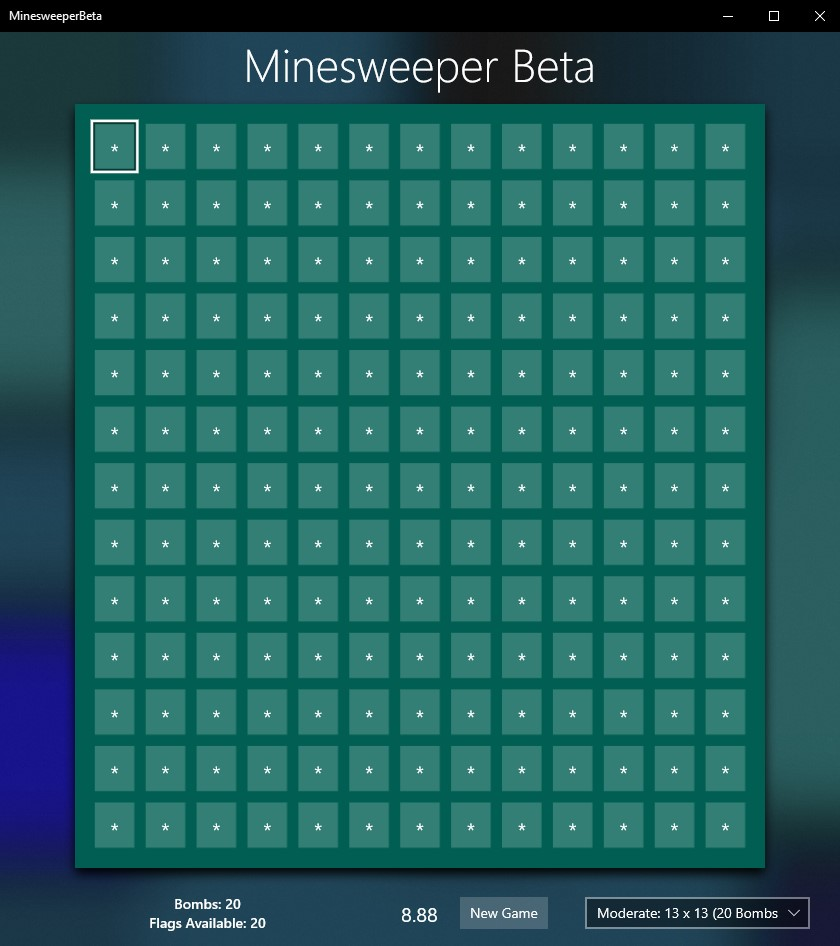

# Minesweeper Beta UWP Application

This is a simple Minesweeper game made in order to learn some of the basic features of UWP. A core goal is to exploit and adhere to the functionality offered by the Fluent Design platform.

The application does not currently respect MVVM but it is an objective to rectify that.
